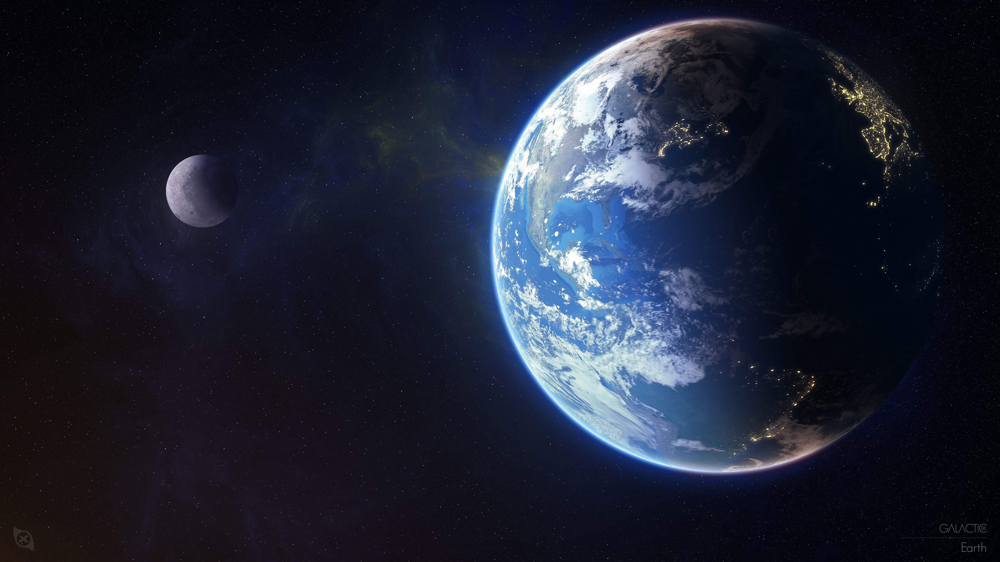

# 8K Image Selector 🌎

## Project Description 🎨

This project is the stepping stone to my deep dive into iOS Development using Native tools such as Swift and Swift UI.
I love all things Apple and the development of Apple applications resonates deeply within me !!

## Technologies Used  💻

This project is crafted using the harmonious blend of Swift and Swift UI.

- [x] Swift
- [x] Swift UI

## Skills Demonstrated 🥋

This project provided a basis for understanding the operations required for effective user experience in a functional mobile application. The following skills were demonstrated:

- **LAYOUT**: The usage of views to place items wherever the developer likes.

- **USER EXPERIENCE**: A clean landscape promoting visibility, visual appeal and ease of use.

- **USER INTERFACE**: An interactive interface allowing easy and effective navigation.

- **Mobile DESIGN**: The brush of creativity to add a unique look to a functional tool.

## Contributing ⚙️

We believe that great knowledge like that which you possess is meant to be shared, and we welcome contributions from fellow geniuses and developers alike. If you have a beneficial or creative code snippet to add or a design improvement to suggest, feel free to fork our repository, make your enhancements, and submit a pull request. Together, let's make the world even more advanced.

## License 🪪

This project is licensed under the [MIT License](LICENSE), which means you're free to modify, distribute, and use the code as you see fit. Just remember to attribute the original work to **Ariel Tyson's GitHub** and keep the aspiring developer spirit alive!

---
